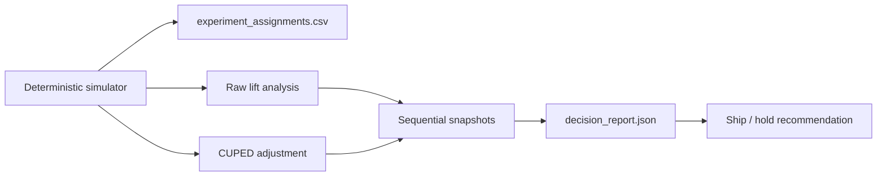

# experimentation-lab

A local-first experimentation decision lab that simulates A/B test assignments, quantifies treatment lift, applies CUPED for variance reduction, snapshots sequential readouts, and produces a decision-ready report.

## Problem

Many experiment demos only show a p-value at the end of a notebook. Real product experimentation requires more discipline: reproducible assignments, clear metric baselines, variance reduction when pre-period data exists, and a readout that explains whether a team should ship or hold. This repo focuses on that decision workflow.

## Architecture

The V1 implementation is intentionally lightweight and transparent:

- a deterministic simulator creates control and treatment assignments with a correlated pre-period metric
- analysis computes raw treatment lift and a two-sample z-style inference path
- CUPED uses the pre-period signal to reduce variance before recomputing lift
- sequential snapshots show how evidence changes at 25%, 50%, 75%, and 100% of the run
- a CLI writes both the simulated assignment file and the decision report so the repo is reproducible without a notebook



## Tradeoffs

This V1 makes three deliberate tradeoffs:

1. The simulator uses deterministic pseudo-random generation instead of a real event warehouse so the full experiment story is runnable offline.
2. The analysis focuses on one primary metric rather than a full experiment platform with guardrails, segment drilldowns, and dashboards.
3. The reporting path is CLI plus JSON rather than Streamlit because reproducibility and clean verification matter more than UI at this stage.

## Repo Layout

```text
experimentation-lab/
├── app/
│   ├── analysis.py
│   ├── cli.py
│   ├── config.py
│   ├── models.py
│   └── simulation.py
├── generated/
├── tests/
└── PROJECT_CHECKLIST.md
```

## Run Steps

### Install Dependencies

```bash
cd /Users/sathwikraonadipelli/Desktop/RESUMES/projects/experimentation-lab
python3 -m pip install -r requirements.txt
```

### Generate the Simulated Experiment Dataset

```bash
make simulate
```

That produces:

- `generated/experiment_assignments.csv`

### Generate the Decision Report

```bash
make report
```

That produces:

- `generated/decision_report.json`

### Run the Full Quality Gate

```bash
make verify
```

## Validation

The V1 repo currently verifies:

- balanced deterministic assignment into control and treatment
- CUPED variance reduction over the raw outcome metric
- a full sequential readout at 25%, 50%, 75%, and 100% of the experiment
- a recommendation that only ships the treatment when the CUPED-adjusted signal is positive and statistically strong

Current expected report snapshot:

- users: `4000`
- raw lift: `6.148`
- CUPED lift: `5.913`
- CUPED variance reduction: `0.5391`
- recommendation: `ship_treatment`

Local quality gates:

- `make lint`
- `make test`
- `make report`
- `make verify`

## Current Capabilities

The current V1 supports:

- deterministic experiment simulation for 4,000 users
- raw treatment vs control lift estimation
- CUPED adjustment using the pre-period metric
- sequential evidence snapshots across the run
- decision-ready JSON output for stakeholder review

## Next Steps

Realistic next follow-up work:

1. add power analysis and minimum detectable effect estimation
2. support guardrail metrics and segment breakdowns
3. add false-positive controls for repeated sequential peeking
4. connect the analysis path to a warehouse-backed input table
5. produce a lightweight stakeholder HTML report on top of the JSON output
