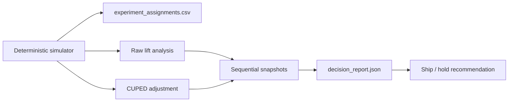

# experimentation-lab

A local-first experimentation decision lab that simulates A/B test assignments, quantifies treatment lift, applies CUPED for variance reduction, snapshots sequential readouts, and produces a decision-ready report.

## Problem

Many experiment demos only show a p-value at the end of a notebook. Real product experimentation requires more discipline: reproducible assignments, clear metric baselines, variance reduction when pre-period data exists, and a readout that explains whether a team should ship or hold. This repo focuses on that decision workflow.

## Architecture

The V1 implementation is intentionally lightweight and transparent:

- a deterministic simulator creates control and treatment assignments with a correlated pre-period metric
- analysis computes raw treatment lift and a two-sample z-style inference path
- CUPED uses the pre-period signal to reduce variance before recomputing lift
- sequential snapshots show how evidence changes at 25%, 50%, 75%, and 100% of the run
- power analysis estimates the minimum detectable effect and whether the current run is over- or under-powered
- a CLI writes both the simulated assignment file and the decision report so the repo is reproducible without a notebook

## Module Map

This repo is easiest to understand when the code is read as a narrow decision pipeline:

1. `app/simulation.py` creates the experiment rows and writes the assignment CSV.
2. `app/analysis.py` computes lift, CUPED adjustment, sequential snapshots, and the final ship/hold recommendation.
3. `app/models.py` defines the experiment record and aggregate statistics.
4. `app/cli.py` exposes `simulate` and `report` entry points so the workflow can run from the terminal.

## Experiment Tracking Strategy

The tracking approach is deliberately file-based so the experiment state is reproducible without notebook cells or external services:

- `app/config.py` holds the run parameters such as seed, output paths, and user count.
- `generated/experiment_assignments.csv` is the raw simulated evidence trail.
- `generated/decision_report.json` is the canonical experiment readout.
- the sequential snapshots in the report preserve the progression from 25% to 100% of the sample.
- the report now carries a `power_analysis` block so the run can answer both "did we detect lift?" and "could we have detected the lift we cared about?"
- any future warehouse integration should preserve the same contract: fixed seed or run id, immutable assignment file, and a single decision artifact per run.



## Tradeoffs

This V1 makes three deliberate tradeoffs:

1. The simulator uses deterministic pseudo-random generation instead of a real event warehouse so the full experiment story is runnable offline.
2. The analysis focuses on one primary metric rather than a full experiment platform with guardrails, segment drilldowns, and dashboards.
3. The reporting path is CLI plus JSON rather than Streamlit because reproducibility and clean verification matter more than UI at this stage.

## Repo Layout

```text
experimentation-lab/
├── app/
│   ├── analysis.py
│   ├── cli.py
│   ├── config.py
│   ├── models.py
│   └── simulation.py
├── generated/
├── tests/
```

## Run Steps

### Install Dependencies

```bash
git clone https://github.com/srn91/experimentation-lab.git
cd experimentation-lab
python3 -m pip install -r requirements.txt
```

### Generate the Simulated Experiment Dataset

```bash
make simulate
```

That produces:

- `generated/experiment_assignments.csv`

### Generate the Decision Report

```bash
make report
```

That produces:

- `generated/decision_report.json`

### Run the Read-Only Hosting Surface

```bash
make serve
```

The service listens on `PORT` when Render sets it, and falls back to `8000` locally. It exposes:

- `GET /health`
- `GET /report`
- `GET /summary`

If `generated/decision_report.json` already exists, the service serves that artifact directly. Otherwise it recomputes the report in memory from the deterministic simulator without mutating the repo.

### Render Deploy Notes

Render can deploy this repo as a Python web service with:

- build command: `python3 -m pip install -r requirements.txt`
- start command: `make serve`

Before deployment, run `make report` once so the generated artifact exists in the repo snapshot. The live API is read-only and is meant to surface the existing experiment summary and full report for reviewers.

Render deploys the latest pushed Git commit from `main`, so any local-only changes must be pushed before a new deploy can use them.

After the service starts, smoke test it with:

```bash
curl http://127.0.0.1:${PORT:-8000}/health
curl http://127.0.0.1:${PORT:-8000}/summary
curl http://127.0.0.1:${PORT:-8000}/report
```

## Hosted Deployment

- Live URL: [experimentation-lab-4re2.onrender.com](https://experimentation-lab-4re2.onrender.com)
- Open this first: [`/summary`](https://experimentation-lab-4re2.onrender.com/summary)
- Browser smoke result: the hosted summary loaded in a real browser and returned the live user count, raw lift, CUPED lift, variance reduction, and `ship_treatment` recommendation.
- Render config: branch `main`, auto-deploy on commit, runtime `python`, build command `python3 -m pip install -r requirements.txt`, start command `make serve`, health check path `/health`

### Run the Full Quality Gate

```bash
make verify
```

## Validation

The V1 repo currently verifies:

- balanced deterministic assignment into control and treatment
- CUPED variance reduction over the raw outcome metric
- a full sequential readout at 25%, 50%, 75%, and 100% of the experiment
- a recommendation that only ships the treatment when the CUPED-adjusted signal is positive and statistically strong

This is the operational story a reviewer should understand:

- the experiment is reproducible because the simulator seed is fixed
- the report is decision-oriented, not notebook-oriented
- the sequential snapshots show how the recommendation changes as evidence accumulates
- the tracking artifacts are explicit files that can be archived, diffed, and reviewed

Current expected report snapshot:

- users: `4000`
- raw lift: `6.148`
- CUPED lift: `5.913`
- CUPED variance reduction: `0.5391`
- minimum detectable effect: `1.0673`
- observed power: `1.0`
- recommendation: `ship_treatment`

Local quality gates:

- `make lint`
- `make test`
- `make report`
- `make serve`
- `make verify`

## Current Capabilities

The current V1 supports:

- deterministic experiment simulation for 4,000 users
- raw treatment vs control lift estimation
- CUPED adjustment using the pre-period metric
- sequential evidence snapshots across the run
- power analysis with minimum detectable effect estimation
- decision-ready JSON output for stakeholder review

## Future Expansion

Possible follow-on work outside the current shipped scope:

1. support guardrail metrics and segment breakdowns
2. add false-positive controls for repeated sequential peeking
3. connect the analysis path to a warehouse-backed input table
4. produce a lightweight stakeholder HTML report on top of the JSON output
5. compare planned MDE against observed effect by launch tier or experiment class
